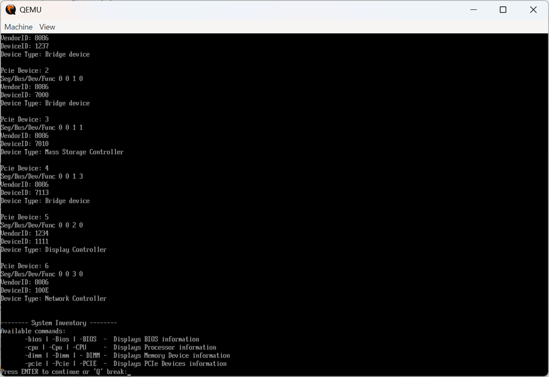
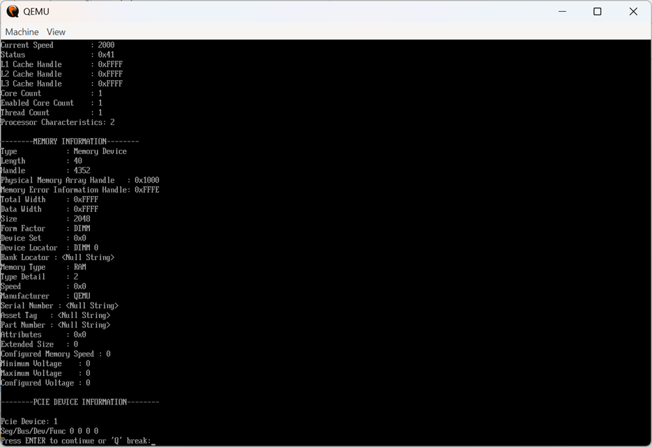
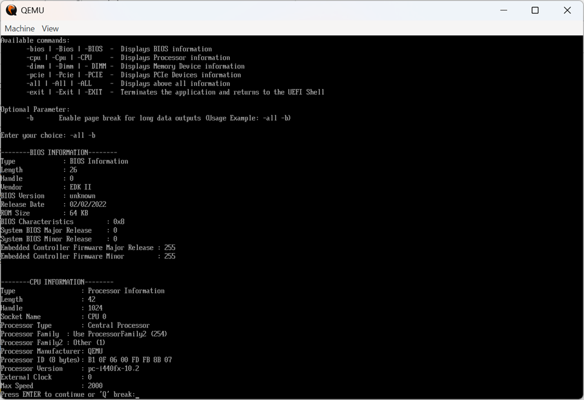
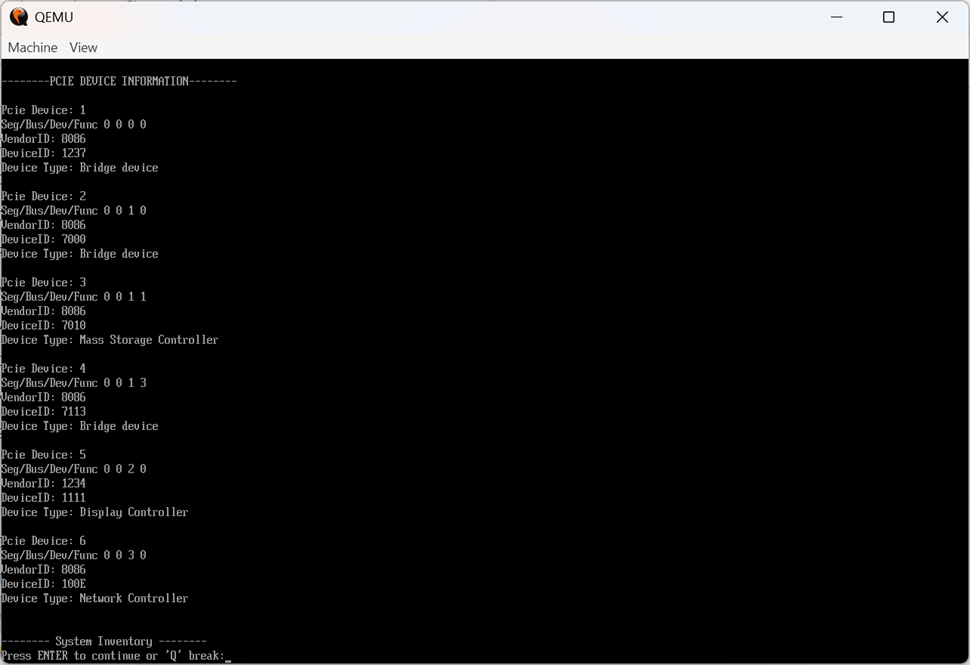
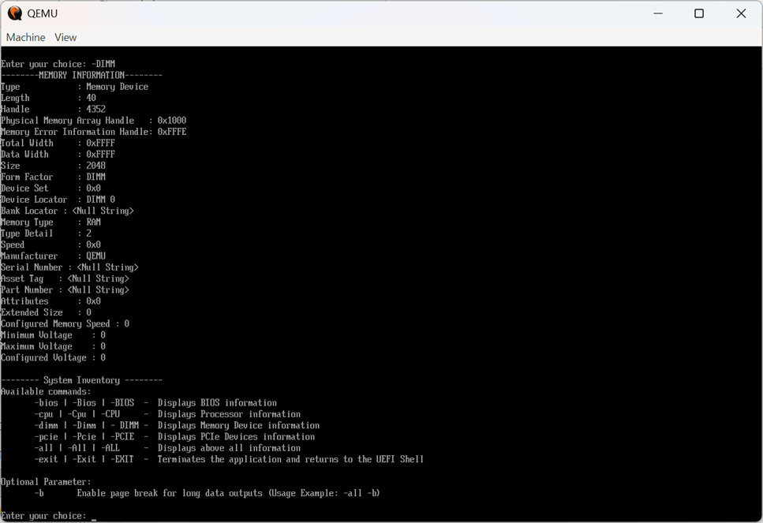
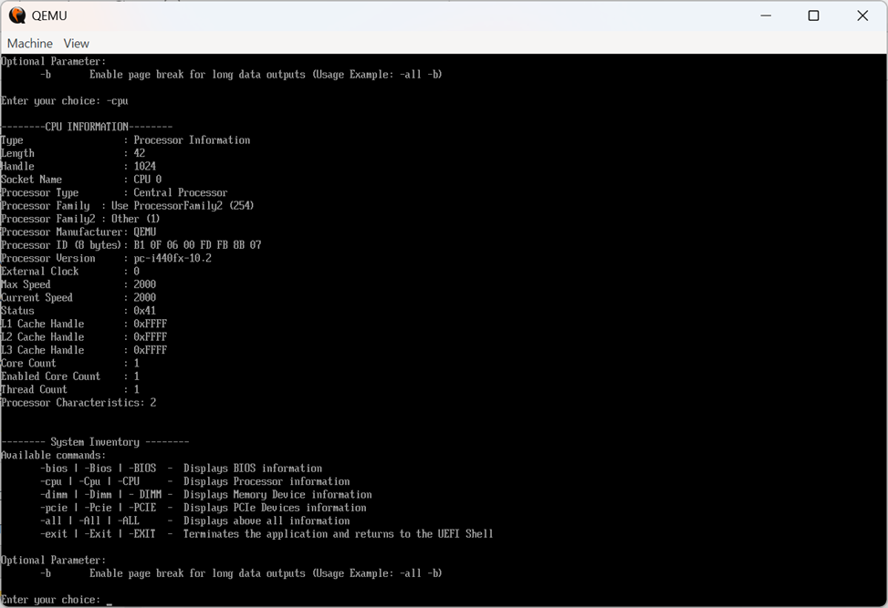
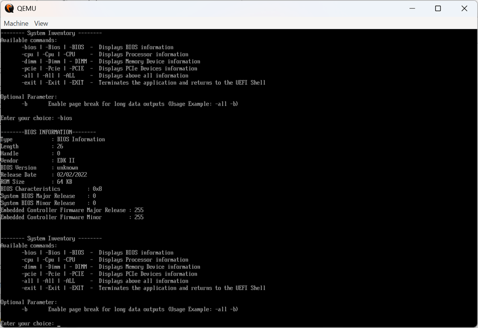
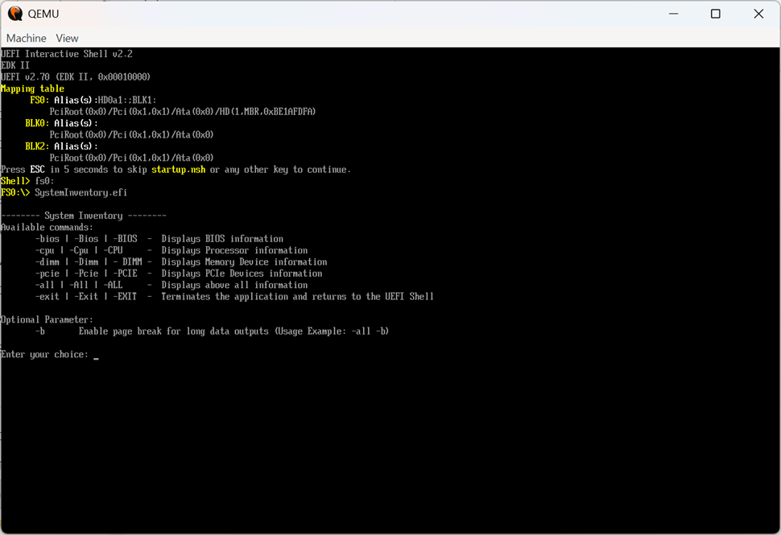
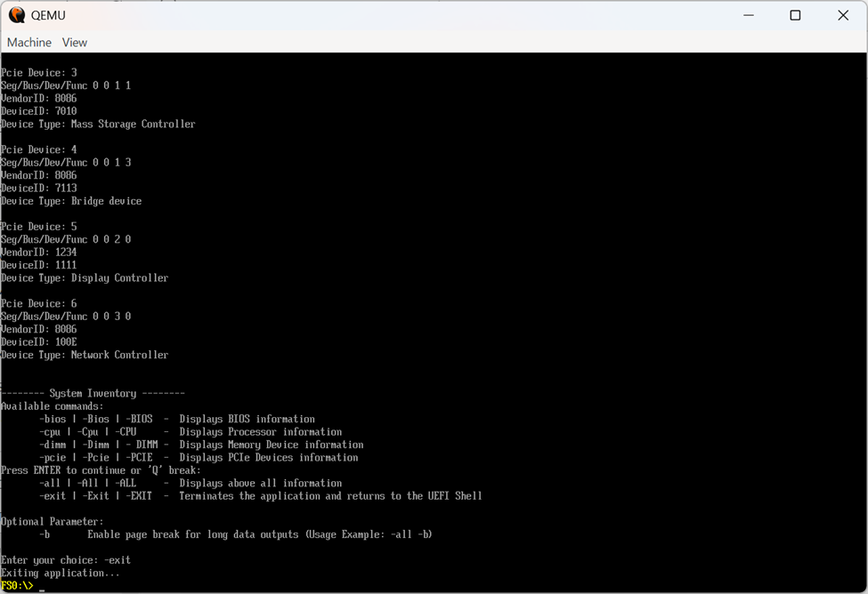

#  System Inventory Pre-Boot Application

A **UEFI pre-boot application** that provides a comprehensive system inventory by retrieving and displaying hardware information about BIOS, CPU, Memory (DIMM), and PCIe devices — all from within the UEFI shell environment.

---

##  Table of Contents

- [Overview](#overview)
- [Features](#features)
- [Protocols Used](#protocols-used)
- [How It Works](#how-it-works)
- [Available Commands](#available-commands)
- [Algorithm](#algorithm)
- [Project Structure](#project-structure)
- [Build & Run](#build--run)
- [Output Screenshots](#output-screenshots)

---

##  Overview

This application runs in the **pre-boot environment** using standard UEFI protocols to read and display low-level hardware details. It provides an interactive command-line menu directly within the UEFI shell, making it useful for hardware diagnostics, firmware validation, and system profiling before the OS loads.

---

##  Features

-  **BIOS Info** — Vendor, version, release date, and firmware details via SMBIOS
-  **CPU Info** — Processor family, architecture, speed, and socket information
-  **DIMM Info** — Memory module type (DDR4, etc.), size, speed, and slot details
-  **PCIe Device Enumeration** — Lists all PCIe devices with Vendor ID, Device ID, and class
-  **Interactive CLI Menu** — Command-driven interface within UEFI Shell
-  **Shell Paging Mode** — Long outputs paginated with `-b` flag
-  **Security Bounds Checking** — Input parsing with buffer overflow protection

---

##  Protocols Used

| Protocol                  | GUID                              |Purpose                           |
|---------------------------|-----------------------------------|----------------------------------|
| SMBIOS Protocol           | `gEfiSmbiosProtocolGuid`          | Read BIOS, CPU, and Memory data  |
| PCI I/O Protocol          | `gEfiPciIoProtocolGuid`           | Enumerate PCIe devices           |
| Shell Parameters Protocol | `gEfiShellParametersProtocolGuid` | Validate shell context           |
| UEFI Shell Library        | `ShellInitialize()`               | Enable paging and shell services |

---

##  How It Works

The application initializes UEFI protocols at startup, then enters an interactive loop where the user types commands. Based on the command, it calls the appropriate data retrieval function, formats the output into human-readable tables, and prints them to the UEFI console.

```
┌─────────────────────────────────────┐
│         System Inventory App        │
│  > Enter Command: -bios / -cpu /    │
│    -dimm / -pcie / -all / -exit     │
└─────────────┬───────────────────────┘
              │
     ┌────────▼────────┐
     │  ParseInput()   │  
     └────────┬────────┘
              │
     ┌────────▼─────────────────────┐
     │     IsValidOptionForm()      │  ← Case-insensitive validation
     └────────┬─────────────────────┘
              │
     ┌────────▼──────────────────────────────────────┐
     │  PrintBiosInformation()                       │
     │  PrintCpuInformation()        ← SMBIOS Loop   │
     │  PrintMemoryInformation()                     │
     │  PrintPcieDeviceInformation() ← PCI I/O Loop  │
     └───────────────────────────────────────────────┘
```

---

##  Available Commands

| Command | Description                            |
|---------|----------------------------------------|
| `-bios` | Display BIOS information               |
| `-cpu`  | Display CPU/Processor information      |
| `-dimm` | Display Memory (DIMM) module details   |
| `-pcie` | Enumerate and display all PCIe devices |
| `-all`  | Display all of the above sequentially  |
| `-exit` | Exit the application                   |

>  **Tip:** Append `-b` to any command (e.g., `-all -b`) to enable **Shell Paging Mode** for long outputs.

---

##  Algorithm

### Step 1 — Protocol Initialization & Environment Setup
- Initialize UEFI Shell library via `ShellInitialize()`
- Locate `gEfiSmbiosProtocolGuid` — if unavailable, system info is disabled
- Open `gEfiShellParametersProtocolGuid` to confirm valid shell context

### Step 2 — Main Service Loop
- Enter an infinite `while(TRUE)` loop for continuous CLI interaction
- Display the System Inventory menu with supported commands

### Step 3 — User Input & String Parsing
- Capture input via `ReadInputLine()` from `gST->ConIn`
- Handle backspace (`CHAR_BACKSPACE`) and carriage return (`CHAR_CARRIAGE_RETURN`)
- Tokenize using `ParseInput()` with **security bounds checking** (`MaxCmd`, `MaxOpt`) to prevent stack buffer overflows

### Step 4 — Command Validation & Execution
- Validate using `IsValidOptionForm()` with case-insensitive matching
- Map commands to their respective functions (`PrintBiosInformation()`, etc.)

### Step 5 — Data Retrieval

**SMBIOS (BIOS / CPU / Memory):**
- Iterate records with `mSmbios->GetNext()` filtered by `EFI_SMBIOS_TYPE`
- Extract strings using `GetSmbiosString()` helper — walks null-terminators safely past the formatted structure

**PCIe Enumeration:**
- Locate all handles with `gEfiPciIoProtocolGuid` via `LocateHandleBuffer()`
- For each handle: retrieve **Segment, Bus, Device, Function (SBDF)** via `GetLocation()`
- Read `PCI_TYPE00` header and extract `VendorId`, `DeviceId`, `BaseClass`

### Step 6 — Formatting & Display
- Human-readable translation via static helpers:
  - `GetTypeName()` — SMBIOS types
  - `GetProcessorFamilyName()` — e.g., "Intel Core i7"
  - `GetMemoryTypeName()` — e.g., "DDR4"
  - `GetPciDeviceType()` — e.g., "Mass Storage Controller"
- Output printed as formatted tables using `Print()`

### Step 7 — Clean Exit
- `-exit` frees all allocated memory (e.g., PCIe `HandleBuffer`)
- Displays termination message and returns `EFI_SUCCESS` to the UEFI Shell

---


##  Build & Run

### Prerequisites
- [EDK2 (UEFI Development Kit)](https://github.com/tianocore/edk2)
- UEFI-compatible build toolchain (e.g., GCC5 or VS2019)
- QEMU (for emulation) or a UEFI shell-capable system

### Build Steps

```bash
# Clone EDK2 and set up the environment
git clone https://github.com/tianocore/edk2.git
cd edk2

# Copy this project into the appropriate package
cp -r SystemInventory/ MdeModulePkg/Application/

# Build
build -a X64 -t GCC5 -p MdeModulePkg/MdeModulePkg.dsc -m MdeModulePkg/Application/SystemInventory/SystemInventory.inf
```

### Run in UEFI Shell

```
Shell> fs0:
fs0:\> SystemInventory.efi
```

---

##  Output Screenshots

> The following screenshots show the application running in the UEFI Shell environment.

| Command | Output |
|---------|--------|
| `-bios` | BIOS vendor, version, release info |
| `-cpu` | Processor family, speed, socket |
| `-dimm` | Memory modules, type, size |
| `-pcie` | PCIe device list with class codes |
| `-all` | Complete system inventory |











---

##  Author

> Jothi Lakshmi

---

##  License

This project is licensed under the [MIT License](LICENSE).
